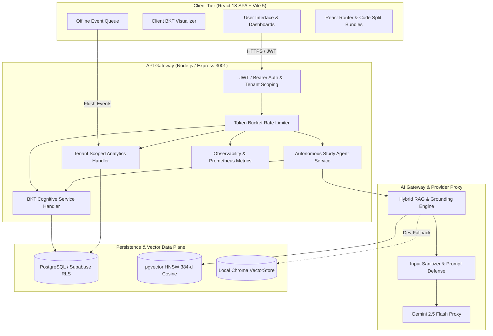

# Ming System Architecture Overview

**Platform Version:** Ming v1.0.0  
**Target Environment:** Node.js 20+, React 18, TypeScript 5.3, PostgreSQL 15+ (pgvector) / SQLite LibSQL  
**Scope:** Verified multi-tier system topology, ingestion pipelines, cognitive modeling, and security boundaries.

---

## 1. System Topology & Data Flow

Ming is architected as an end-to-end, multi-tier adaptive learning platform that decouples user interaction, cognitive inference, vector retrieval, and persistent storage.



---

## 2. Multi-Tier Technology Stack

| Layer | Technologies & Libraries | Role & Responsibilities |
| :--- | :--- | :--- |
| **Presentation Tier** | React 18, Vite 5, TypeScript 5.3, Tailwind CSS, Lucide Icons, Radix UI, Recharts, KaTeX | Responsive user interface, real-time mastery visualization, interactive flashcards, grounded Q&A drawer, and evaluation dashboards. |
| **Client Reliability** | Custom `OfflineQueue` (IndexedDB / LocalStorage backing) | Buffers learner activity telemetry and study events during network interruptions; automatically deduplicates and flushes upon reconnection. |
| **API Gateway Tier** | Node.js, Express, TypeScript, Helmet, CORS, Token-bucket Rate Limiter | Secure REST endpoints, request authentication, user context resolution, rate limiting (120 req/min), tenant scoping, and Prometheus-compatible metrics (`/metrics`). |
| **Cognitive Modeling** | Bayesian Knowledge Tracing (`server/bktService.ts`, `src/utils/bkt.ts`), SuperMemo SM-2 | Authoritative latent mastery estimation ($pL_0=0.15, pT=0.10, pG=0.20, pS=0.10$), difficulty scaling, and spaced-repetition scheduling. |
| **Autonomous Agent** | Autonomous Study Agent (`server/studyAgentService.ts`, `src/services/agentActionEngine.ts`) | Analyzes multi-skill mastery states, detects learning gaps, and generates targeted study interventions. |
| **RAG & Vector Retrieval** | Python 3.11, `sentence-transformers` (`all-MiniLM-L6-v2`), `server/rag_engine.py` | Semantic paragraph chunking, 384-dimensional dense embeddings, cosine nearest-neighbor search, and inline citation resolution. |
| **Persistence Tier** | PostgreSQL 15+ with `pgvector` / SQLite LibSQL (Development) | ACID relational persistence across 11 domain models, Row-Level Security (RLS) enforcement, and vector indexing via HNSW. |
| **AI Inference** | Google Gemini 2.5 Flash (`gemini-2.5-flash`, fallback: `gemini-flash-latest`) via server proxy | Context-bounded question answering, diagnostic assessment generation, and rubric-based open response evaluation. |

---

## 3. Multimodal Ingestion & Grounded Retrieval

### Ingestion Pipeline
1. **Document Parsing:** Accepts Markdown (`.md`), Plain Text (`.txt`), and PDF documents. Extracts document structure, headings, and paragraph boundaries.
2. **Semantic Chunking:** Partitions source material into chunks of 600 tokens with a 120-token overlapping window to prevent semantic boundary clipping.
3. **Dense Embedding:** Chunks are vectorized using `all-MiniLM-L6-v2`, producing fixed 384-dimensional unit-normalized embeddings.
4. **Metadata Tagging:** Chunks are tagged with `user_id`, `document_id`, `source_title`, `section_heading`, `chunk_index`, and access level (`USER` vs. `SYSTEM_PUBLIC`).
5. **Fail-Closed Vector Insertion:** Inserted into PostgreSQL `rag_chunks` table indexed with HNSW (`vector_cosine_ops`). If pgvector is configured but unreachable, the system fails closed rather than silently corrupting search results.

### Grounded Retrieval & Citation Attribution
- **Candidate Retrieval:** Given a user question, Ming embeds the query and retrieves the top-$k$ nearest chunks ($k=5$) via cosine similarity.
- **Relevance Gate:** Chunks falling below a cosine similarity threshold ($\tau = 0.55$) are filtered out. If all chunks fall below $\tau$, Ming executes an Out-of-Domain refusal without invoking the generation model.
- **Context Injection:** Retained chunks are formatted into an isolated prompt template with explicit numbering and boundary markers.
- **Attribution Badging:** The model is constrained to generate citations referencing specific chunk numbers (`[1]`, `[2]`). The frontend parses these citations into clickable badges that open the source text drawer.

---

## 4. Cognitive Modeling: Bayesian Knowledge Tracing (BKT)

Ming replaces superficial flashcard repetitions with standard **Bayesian Knowledge Tracing (Corbett & Anderson, 1994)**.

### Mathematical Formulation
For each student $u$ and Knowledge Component (KC) $k$, Ming models latent mastery $P(L_t)$ as a Hidden Markov Model:

$$P(L_0) = 0.15 \quad \text{(Initial Mastery Prior)}$$
$$P(T) = 0.10 \quad \text{(Transition Probability)}$$
$$P(G) = 0.20 \quad \text{(Guess Probability)}$$
$$P(S) = 0.10 \quad \text{(Slip Probability)}$$

Difficulty-adjusted parameters:
- **Easy:** $P(G) = 0.25, P(S) = 0.05$
- **Medium (Default):** $P(G) = 0.20, P(S) = 0.10$
- **Hard:** $P(G) = 0.10, P(S) = 0.20$

Upon observing an assessment response $O_t \in \{0, 1\}$ at opportunity $t$:

**1. Posterior Update (Evidence Integration):**
$$P(L_t \mid O_t = 1) = \frac{P(L_{t-1}) \cdot (1 - P(S))}{P(L_{t-1}) \cdot (1 - P(S)) + (1 - P(L_{t-1})) \cdot P(G)}$$

$$P(L_t \mid O_t = 0) = \frac{P(L_{t-1}) \cdot P(S)}{P(L_{t-1}) \cdot P(S) + (1 - P(L_{t-1})) \cdot (1 - P(G))}$$

**2. Learning Update (Knowledge Transition):**
$$P(L_t) = P(L_t \mid O_t) + (1 - P(L_t \mid O_t)) \cdot P(T)$$

### Dual-State Synchrony & Parity
- **Server Authority (`server/bktService.ts`):** Authoritative state is computed server-side with identical default parameters ($pL_0=0.15, pT=0.10, pG=0.20, pS=0.10$) and persisted with student learning records.
- **Client Mirror (`src/utils/bkt.ts`):** Client computes real-time predictions with identical parameters for immediate visual updates on the Mastery Radar chart, then reconciles with server response.

---

## 5. Security, Tenant Isolation & Row-Level Security (RLS)

Ming implements a strict **Zero-Trust Multi-Tenant Security Model**:

1. **Cryptographic Identity Verification:**
   - Every incoming request to protected API routes must pass `resolveContextUser()`.
   - The user ID is extracted solely from the verified JWT payload or cryptographically signed session token.
   - Client-provided identifiers (`req.body.userId` or `req.query.userId`) are explicitly rejected for access authorization.

2. **Database Row-Level Security (RLS):**
   - Relational tables (`analytics_events`, `study_sessions`, `flashcards`, `user_bkt_states`) enforce:
     ```sql
     CREATE POLICY user_tenant_isolation ON table_name
     FOR ALL USING (auth.uid()::text = user_id);
     ```
   - Vector table `rag_chunks` enforces:
     ```sql
     CREATE POLICY rag_chunks_tenant_isolation ON public.rag_chunks
     FOR SELECT USING (
       tenant_type = 'SYSTEM_PUBLIC' OR auth.uid()::text = user_id
     );
     ```

3. **Post-Retrieval Defense in Depth:**
   - Vector search responses undergo a secondary server-side filter before any text chunk is forwarded to the LLM prompt. Any chunk whose `user_id` does not match the active session user or verified public curriculum is discarded.

4. **Rate Limiting & Abuse Prevention:**
   - In-memory sliding token-bucket rate limiting restricts API callers to a maximum of 120 requests per minute per IP/user token. Excess requests return `HTTP 429 Too Many Requests`.

---

## 6. Comprehensive Feature Status Matrix

To ensure absolute transparency and scientific integrity, capabilities are classified into five concrete verified states:
- **Implemented & Tested:** Fully functional, verified by automated test suites, demonstrable in live environment.
- **Partially Implemented:** Functional in core paths, but contains specific fallbacks or simulated dependencies.
- **Planned:** Architected and documented, but awaiting subsequent release cycles.
- **Unverified:** Present in codebase but without automated test coverage or benchmark validation.

| Feature / Subsystem | Implementation State | Verification Evidence | Notes / Constraints |
| :--- | :--- | :--- | :--- |
| **Markdown / Text Ingestion** | Implemented & Tested | `server/rag_engine.py`, Unit tests | 600-token chunking with 120-token overlap. |
| **PDF Ingestion** | Implemented & Tested | `src/components/viewer/`, `pdfjs-dist` | Lazy-loaded `vendor-pdf` chunk to prevent bundle bloat. |
| **Local Vector Search (Chroma)** | Implemented & Tested | `server/vector_store_chroma.py` | Default for offline development and local tests. |
| **Cloud Vector Search (pgvector)** | Implemented & Tested | `server/vector_store_pgvector.py`, RLS migration | HNSW cosine similarity on Supabase/Postgres. |
| **Grounded Q&A with Citations** | Implemented & Tested | Track B Evaluation ($N=64$), 96% Faithfulness | Citations rendered as interactive source badges. |
| **OOD Refusal Gate** | Implemented & Tested | Track B Evaluation ($N=6$), 100% Refusal | Cosine thresholding rejects off-topic queries ($n=6$). |
| **Bayesian Knowledge Tracing (BKT)** | Implemented & Tested | Track D Evaluation ($N=40$ synthetic traces, Brier 0.277) | Implemented both in Node.js server and React frontend ($L_0=0.15, T=0.10$). |
| **SM-2 Spaced Repetition** | Implemented & Tested | `src/components/flashcards/FlashcardReview.tsx` | Calculates ease factor, interval, and next due date. |
| **Autonomous Study Agent** | Implemented & Tested | Track E Evaluation ($N=5$ scenarios, 100% completion) | Generates targeted diagnostic study actions. |
| **Study Session Persistence** | Implemented & Tested | `server/analyticsService.ts`, Vitest suite | Persists duration, cards reviewed, and daily streaks. |
| **Offline Telemetry Queue** | Implemented & Tested | `src/lib/offlineQueue.ts`, Phase 9 Vitest suite | Auto-buffers and syncs telemetry on reconnection. |
| **Prometheus Observability** | Implemented & Tested | `server/observability.ts`, `/metrics` endpoint | Tracks request rates, errors, and latency percentiles. |
| **Mobile Drawer Navigation** | Implemented & Tested | `src/components/layout/MobileNavDrawer.tsx` | Responsive mobile viewport support. |
| **Multi-Modal Image Ingestion** | Partially Implemented | Image OCR placeholder present | OCR pipeline extracts basic text; vision model routing planned. |
| **Live Classroom LTI 1.3 LMS Sync** | Planned | Architecture RFC | Canvas/Blackboard grade passback scheduled for future roadmap. |
| **Audio / Video Lecture Transcription** | Planned | Audio upload UI stub | Whisper API integration planned for future release. |
